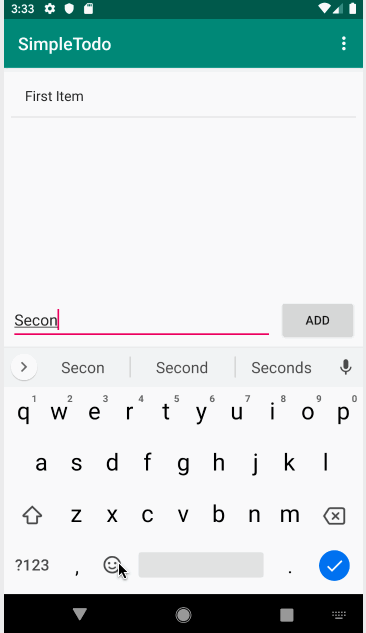

# SimpleTodo

Simple Todo app for CodePath
# Project 1 - Simple Todo

Simple Todo is an android app that allows building a todo list and basic todo items management functionality including adding new items, editing and deleting an existing item.

Submitted by: Angelica Castillejos

Time spent: 5 hours spent in total

## User Stories

The following **required** functionality is completed:

* [X] User can **view a list of todo items**
* [X] User can **successfully add and remove items** from the todo list
* [X] User's **list of items persisted** upon modification and and retrieved properly on app restart

The following **stretch** features are implemented:

* [X] User can **tap a todo item in the list and bring up an edit screen for the todo item** and then have any changes to the text reflected in the todo list

The following **additional** features are implemented:

* [X] Has a drop- down menu that includes different options a user can click. 

## Video Walkthrough

Here's a walkthrough of implemented user stories:

GIF created with [LiceCap](http://www.cockos.com/licecap/).

## Notes

A challenge I faced while building this application was connecting the implementation to the design and understanding that connection. It was interesting how the front-end and back-end "communicated". I tried to challenege myself further by creating a drop down menu with different options the user can click.

## License

    Copyright [2019] [Angelica Castillejos]

    Licensed under the Apache License, Version 2.0 (the "License");
    you may not use this file except in compliance with the License.
    You may obtain a copy of the License at

        http://www.apache.org/licenses/LICENSE-2.0

    Unless required by applicable law or agreed to in writing, software
    distributed under the License is distributed on an "AS IS" BASIS,
    WITHOUT WARRANTIES OR CONDITIONS OF ANY KIND, either express or implied.
    See the License for the specific language governing permissions and
    limitations under the License.
